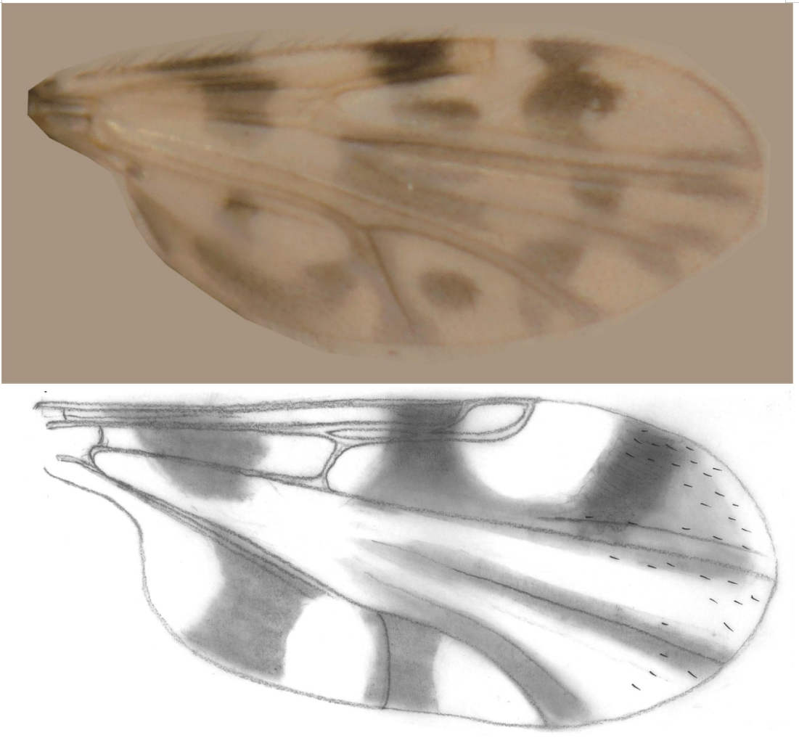
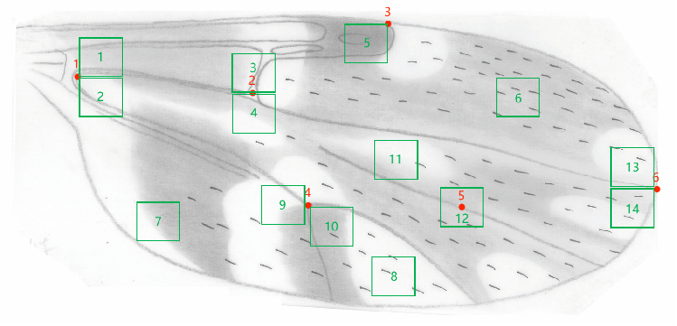
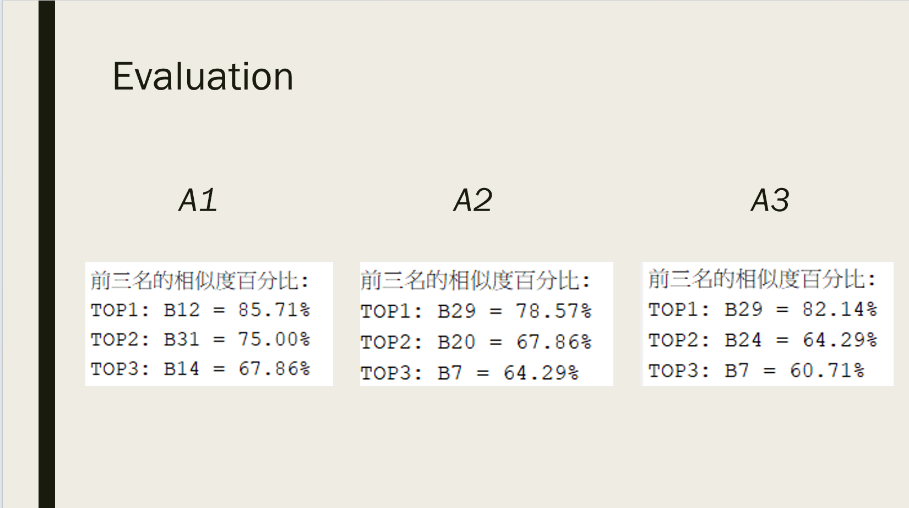
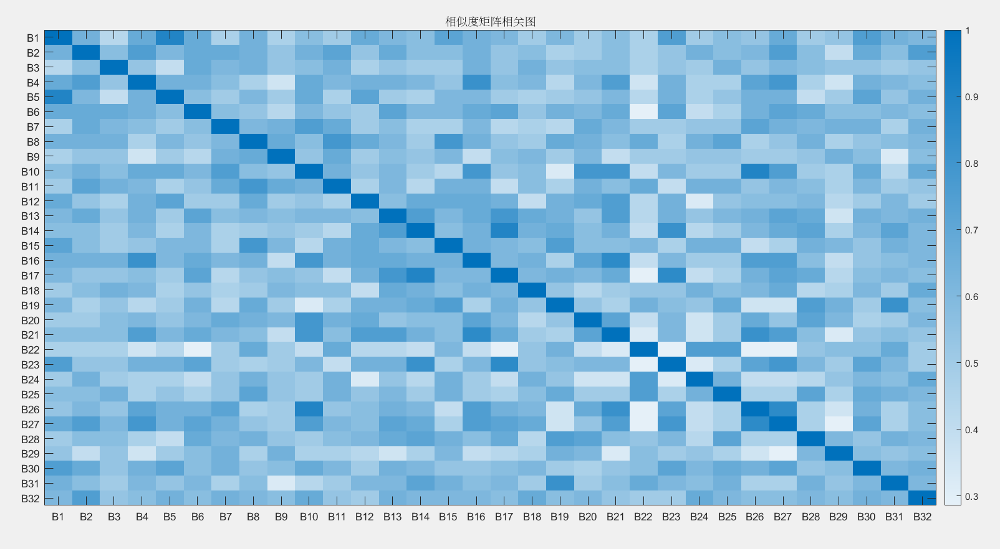

<center><h1>Temperature & Pressure Monitoring Project</h1></center>
Using MATLAB to match photos and hand-drawn images of insect wings



# Insect Wing Image Matching Project

This project uses MATLAB to match photos and hand-drawn images of insect wings.

## File Description

1. **Program Files**
    - `MAIN.m`: Contains image processing, point selection, and calls the encoding program. Finally, all encodings are stored in the library `.mat` file.
    - `MAIN2.m`: Compares the specified photo code with all hand-drawn image codes for similarity.
    - `correlationmap.m`: Compares all hand-drawn image codes in the library `.mat` file for similarity and generates a correlation map.

2. **Function Files**
    - `calculateBinaryCode.m`: Encodes the nearby feature region for the selected feature point coordinates and stores it in the specified library `.mat` file.
    - `calculateSimilarity.m`: Compares the specified photo code with all hand-drawn image codes for similarity.
    - `selectFeaturePt.m`: Function to select feature point coordinates.

3. **Library Files**
    - `CODELIBRARY.mat`: Stores encoded data of all processed photos and hand-drawn images, which can be directly used for generating correlation maps and similarity comparisons.
    - `CODELIBRARYTEST.mat`: An empty library `.mat` file used for testing the main program.

4. **Folders**
    - `A`: Stores all photos.
    - `B`: Stores all hand-drawn images.

5. **PPT**
    - `PPT`: Contains animations; please play to view the full content.

## Program Running Steps

### Image Processing, Point Selection, Encoding, and Storing in Library File



1. Open the `MAIN.m` program and modify the 'path' at the beginning of the code to the folder path of photos or hand-drawn images.
    ```matlab
    % Example: sourceFolderPath = 'D:\Desktop\InsectWings\Final\MaybeFinalVersion\A';
    ```

2. Modify the label 'B' at line 40 of the code to the required label. For example, change it to 'B' when encoding images in the hand-drawn image folder.
    ```matlab
    % Example: identifier = ['A', num2str(i)]; % Change to 'A' when encoding photos
    ```

3. Run the program. After traversing all images in the folder and selecting feature points, the code will store the results in the `CODELIBRARYTEST.mat` file for testing. The encoded data of all processed photos and hand-drawn images are stored in the `CODELIBRARY.mat` file, which can be directly used for subsequent steps to generate correlation maps and similarity comparisons.

### Similarity Comparison



1. Open the `MAIN2.m` program and modify the library `.mat` file name and photo code in the program.
    ```matlab
    % Example: calculateSimilarity(A3, 'CODELIBRARY.mat'); % Compare similarity between A3 and all hand-drawn image codes
    ```

2. Run the program to generate all similarity percentages and display the top 3.

### Correlation Map Generation



1. Open the `correlationmap.m` program and modify the library `.mat` file name in the program (if needed).
2. Run the program to generate a correlation map of all hand-drawn image codes.
